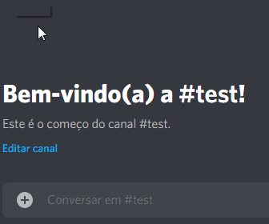
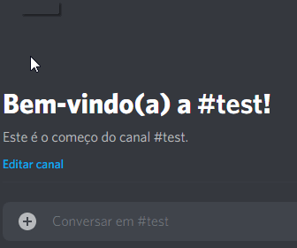

# Discord.js-colelctor

Library to easily create message collector and reactions on discord.js v12, with customization ways.

---
# CHANGELOG - V1.2.0

• New functions to create reactions menu, you can use with `ReactionCollector.menu(options)`

---
# CHANGELOG - V1.1.0

• Now collectors work in DM Channels, but cannot delete user reaction/message
• [BETA] Added ReactionRoleManager, easy mode to create reactions roles with storage system, when finish i will share examples and gifs explaining how this work.

---

## Reaction menu

To create a reaction menu with multiple pages.


```js
const botMessage = await message.reply('Lorem Menu')
ReactionCollector.menu({
  botMessage,
  user: message,
  pages: {
    '✅': {
      embed: {
        description: 'Minim magna do quis nulla excepteur dolore aute aute minim amet eu ea.'
      }
    },
    '706597879523049585': {
      content: 'Lorem Text ',
      embed: {
        description: 'Nisi ullamco magna in id ea anim aliquip officia ex excepteur est nulla exercitation.'
      }
    },
    '📢': {
      embed: {
        description: 'Mollit fugiat aliqua nisi in sunt pariatur laboris eiusmod anim magna ut id occaecat eu.'
      }
    }
  }
});
```

### Options param

`ReactionCollector.menu(options);`

```js
{
    botMessage: Message // Message sent from bot.
    user: UserResolvable // User who will react, must be User | Snowflake | Message | GuildMember.
    pages: Array // Array with menu pages.
    collectorOptions?: ReactionCollectorOptions // Default discord.js collector options.
}
```

## Simple reaction collector

To use in multiple actions, react and then trigger one function to do things.


```js
const { ReactionCollector } = require("discord.js-collector");

const botMessage = await message.channel.send("Simple choice yes/no...");
ReactionCollector.question({
  botMessage,
  user: message,
  onReact: [
    async (botMessage) => await botMessage.channel.send("You've choice yes."),
    async (botMessage) => await botMessage.channel.send("You've choice no."),
  ],
});
```

### Options param

`ReactionCollector.question(options);`

```js
{
    botMessage: Message // Message sent from bot.
    user: UserResolvable // User who will react, must be User | Snowflake | Message | GuildMember.
    collectorOptions?: ReactionCollectorOptions // Default discord.js collector options.
    reactions?: Array<EmojiResolvable> // List of emojis will use to create reaction question.
    onReact?: Array<Function> // When user click on reaction, will trigger respective funcion, in order by reaction list.
    deleteReaction?: boolean // Default true, when user react if it's enabled will remove user reaction.
    deleteAllReactionsWhenCollectorEnd?: boolean // Default true, when collector end, if it's enabled will remove all reactions in botMessage.
}
```

## Simple yes/no reaction collector

To use in `if` statements, the asynchronous reaction collector returning Promise <boolean> is more practical



```js
const { ReactionCollector } = require("discord.js-collector");

const botMessage = await message.channel.send("Simple choice yes/no...");
const options = { botMessage, user: message };
if (await ReactionCollector.asyncQuestion(options)) {
  await botMessage.channel.send("You've choice yes.");
} else {
  await botMessage.channel.send("You've choice no.");
}
```

### Options param

`ReactionCollector.asyncQuestion(options);`

```js
{
    botMessage: Message // Message sent from bot.
    user: UserResolvable // User who will react, must be User | Snowflake | Message | GuildMember.
    collectorOptions?: ReactionCollectorOptions // Default discord.js collector options.
    reactions?: Array<EmojiResolvable> // Max 2 emojis - List of emojis will use to create reaction question.
    deleteReaction?: boolean // Default true, when user react if it's enabled will remove user reaction.
    deleteAllReactionsWhenCollectorEnd?: boolean // Default true, when collector end, if it's enabled will remove all reactions in botMessage.
}
```

## Embeds pagination

Easier paginator embeds, with back/skip reaction to change current page.


```js
const { ReactionCollector } = require("discord.js-collector");

const botMessage = await message.channel.send("Simple paginator...");
ReactionCollector.paginator({
  botMessage,
  user: message,
  pages: [
    new MessageEmbed({ description: "First page content..." }),
    new MessageEmbed({ description: "Second page content..." }),
  ],
});
```

### Options param

`ReactionCollector.paginator(options);`

```js
{
    botMessage: Message // Message sent from bot.
    user: UserResolvable // User who will react, must be User | Snowflake | Message | GuildMember.
    collectorOptions?: ReactionCollectorOptions // Default discord.js collector options.
    reactions?: Array<EmojiResolvable> // List of emojis will use to create reaction question. First emoji will be use to back page, second to skip page.
    deleteReaction?: boolean // Default true, when user react if it's enabled will remove user reaction.
    deleteAllReactionsWhenCollectorEnd?: boolean // Default true, when collector end, if it's enabled will remove all reactions in botMessage.
}
```

---

## Simple messages collector

Await for messages from user, and when it's send will fire a trigger to do things.


```js
const { MessageCollector } = require("discord.js-collector");

const botMessage = await message.channel.send("Awaiting a message");
MessageCollector.question({
  botMessage,
  user: message.author.id,
  onMessage: async (botMessage, message) =>
    await botMessage.channel.send(`Your answer was ${message.content}`),
});
```

### Options param

`MessageCollector.question(options);`

```js
{
    botMessage: Message // Message sent from bot.
    user: UserResolvable // User who will react, must be User | Snowflake | Message | GuildMember.
    collectorOptions?: MessageCollectorOptions // Default discord.js collector options.
    onMessage?: async(botMessage, message) => {} // Trigger fired when user send a message.
    deleteMessage?: boolean // Default true, when user send a message if it's enabled will delete it.
}
```

## Async message collector

Await for message from user, and when user send, will return user message as Promise<Message>.



```js
const { MessageCollector } = require("discord.js-collector");

const botMessage = await message.channel.send("Awaiting a message");
const userMessage = await MessageCollector.asyncQuestion({
  botMessage,
  user: message.author.id,
});
if (userMessage.content === "ping") {
  await message.channel.send("pong!");
}
```

### Options param

`MessageCollector.asyncQuestion(options);`

```js
{
    botMessage: Message // Message sent from bot.
    user: UserResolvable // User who will react, must be User | Snowflake | Message | GuildMember.
    collectorOptions?: MessageCollectorOptions // Default discord.js collector options.
    deleteMessage?: boolean // Default true, when user send a message if it's enabled will delete it.
}
```
